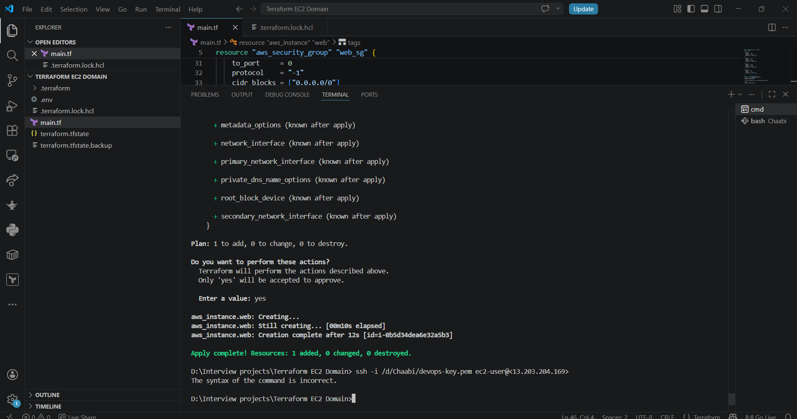
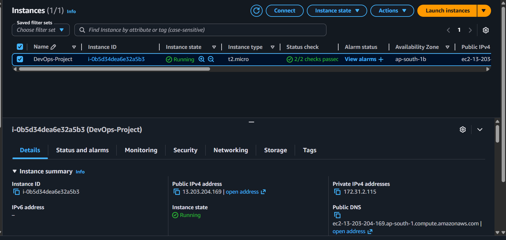
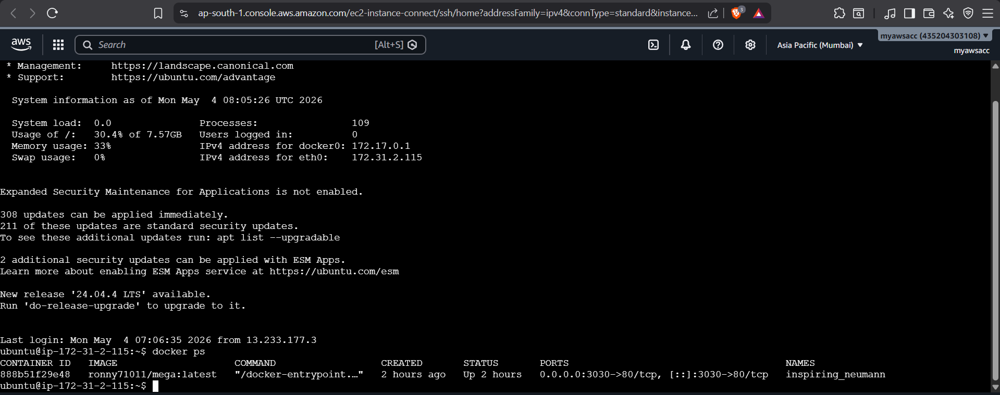
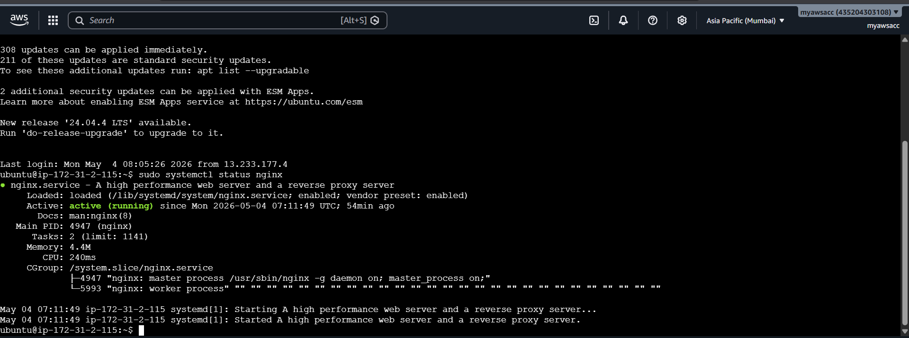
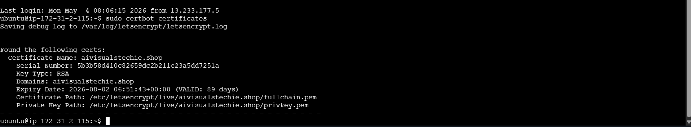
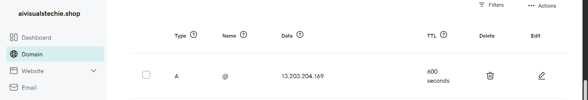
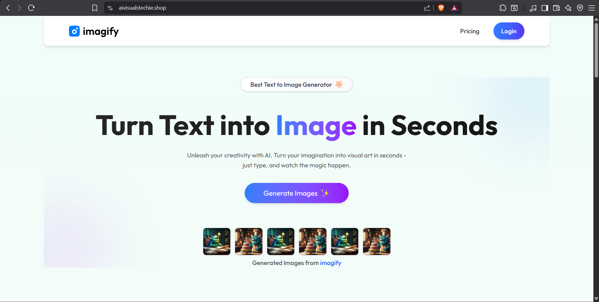

# 🚀 Infrastructure Provisioning & Secure Web App Deployment | Terraform + EC2 + Docker + Nginx + HTTPS


---

## 📌 Overview

End-to-end automated infrastructure provisioning and secure web application deployment on AWS using **Terraform (IaC)**, **Docker**, **Nginx reverse proxy**, and **SSL/TLS via Certbot** — all on a custom GoDaddy domain.

> ⚠️ AWS resources are torn down to avoid costs. All Terraform code, configs, and screenshots are preserved in this repo.

---

## 🏗️ Architecture

```
User Request (HTTPS)
       ↓
Custom GoDaddy Domain (DNS)
       ↓
AWS EC2 Instance (Terraform Provisioned)
       ↓
Nginx Reverse Proxy (SSL Termination)
       ↓
Docker Container (Web App)
```

---

## ⚙️ Tech Stack

| Category | Tools |
|---|---|
| Infrastructure as Code | Terraform |
| Cloud | AWS EC2, Security Groups, IAM |
| Containerization | Docker |
| Web Server / Reverse Proxy | Nginx |
| SSL/TLS | Certbot (Let's Encrypt) |
| DNS | GoDaddy Custom Domain |

---

## 🎯 What Was Implemented

- ✅ Provisioned **AWS EC2 instance** and Security Groups using Terraform (IaC)
- ✅ Automated port configuration (22, 80, 443) via Terraform Security Groups
- ✅ Deployed containerized web app using **Docker**
- ✅ Configured **Nginx as reverse proxy** — container not exposed directly
- ✅ Secured traffic with **Certbot SSL/TLS certificates** (HTTPS)
- ✅ Integrated **custom GoDaddy domain** with EC2 public IP

---

## 📸 Project Screenshots

### 🏗️ Terraform Infrastructure Provisioning


### ☁️ EC2 Instance Running


### 🐳 Docker Container Running


### ⚙️ Nginx Reverse Proxy Config


### 🔒 SSL Certificate (HTTPS)


### 🌐 DNS Configuration


### 📤 Final Output


---

## 📂 Repository Structure

```
terraform-ec2-nginx-docker/
├── main.tf              # EC2 + Security Group provisioning
├── variables.tf         # Input variables
├── outputs.tf           # Output values (EC2 IP etc.)
├── .terraform.lock.hcl  # Provider lock file
├── .gitignore           # Ignored sensitive files
├── Outputs/             # Project screenshots
└── README.md
```

---

## 🧠 Challenges Faced & Solved

| Challenge | Solution |
|---|---|
| App not accessible after deployment | Fixed missing route config in Nginx |
| SSL certificate failure | Fixed missing DNS A record pointing to EC2 IP |

---

## 🔁 How to Reproduce

```bash
# 1. Initialize Terraform
terraform init

# 2. Preview infrastructure changes
terraform plan

# 3. Provision AWS infrastructure
terraform apply

# 4. SSH into EC2 and run Docker container
ssh -i key.pem ubuntu@<EC2-IP>
docker run -d -p 3000:3000 your-image

# 5. Configure Nginx reverse proxy
# 6. Run Certbot for SSL
sudo certbot --nginx -d yourdomain.com

# 7. Destroy when done (avoid AWS costs)
terraform destroy
```

---

## 👨‍💻 Author

**Sujal Shaha** | [LinkedIn Profile](https://www.linkedin.com/in/sujal-shaha-15832b286/) | [GitHub](https://github.com/sujal-07-Ronny)

🏅 AWS Certified Cloud Practitioner (CLF-C02)
